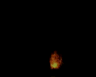

# Effects 0 - 50

|    | ID | Name | Desc |
|----|----|------|------|
|  | 0 | EF_HIT1 | Regular Hit |
|  | 1 | EF_HIT2 | Bash |
|  | 2 | EF_HIT3 | Melee Skill Hit |
|  | 3 | EF_HIT4 | Melee Skill Hit |
|  | 4 | EF_HIT5 | Melee Skill Hit |
|  | 5 | EF_HIT6 | Melee Skill Hit |
|  | 6 | EF_ENTRY | Being Warped |
|  | 7 | EF_EXIT | Item Heal effect |
|  | 8 | EF_WARP | Yellow Ripple Effect |
|  | 9 | EF_ENHANCE | Different Type of Heal |
|  | 10 | EF_COIN | Mammonite |
|  | 11 | EF_ENDURE | Endure |
|  | 12 | EF_BEGINSPELL | Yellow cast aura |
|  | 13 | EF_GLASSWALL | Blue Box |
|  | 14 | EF_HEALSP | Blue restoring effect |
|  | 15 | EF_SOULSTRIKE | Soul Strike |
|  | 16 | EF_BASH | Hide |
|  | 17 | EF_MAGNUMBREAK | Magnum Break |
|  | 18 | EF_STEAL | Steal |
|  | 19 | EF_HIDING | (Invalid) |
|  | 20 | EF_PATTACK | Envenom/Poison |
|  | 21 | EF_DETOXICATION | Detoxify |
|  | 22 | EF_SIGHT | Sight |
|  | 23 | EF_STONECURSE | Stone Curse |
|  | 24 | EF_FIREBALL | Fire Ball |
|  | 25 | EF_FIREWALL | Fire Wall |
|  | 26 | EF_ICEARROW | A sound (a swipe?) |
|  | 27 | EF_FROSTDIVER | Frost Diver (Traveling to Target) |
|  | 28 | EF_FROSTDIVER2 | Frost Diver (Hitting) |
|  | 29 | EF_LIGHTBOLT | Lightning Bolt |
|  | 30 | EF_THUNDERSTORM | Thunder Storm |
|  | 31 | EF_FIREARROW | Weird bubbles launching from feet |
|  | 32 | EF_NAPALMBEAT | Small clustered explosions |
|  | 33 | EF_RUWACH | Ruwach |
|  | 34 | EF_TELEPORTATION | Old Map Exit Animation (unused) |
|  | 35 | EF_READYPORTAL | Old Warp Portal (unused) |
|  | 36 | EF_PORTAL | Old Warp Portal (unused) |
|  | 37 | EF_INCAGILITY | AGI Up |
|  | 38 | EF_DECAGILITY | AGI Down |
|  | 39 | EF_AQUA | Aqua Benedicta |
|  | 40 | EF_SIGNUM | Signum Crucis |
|  | 41 | EF_ANGELUS | Angelus |
|  | 42 | EF_BLESSING | Blessing |
|  | 43 | EF_INCAGIDEX | Dex + Agi Up |
|  | 44 | EF_SMOKE | Little Fog Smoke. |
|  | 45 | EF_FIREFLY | Faint Little Ball Things. |
|  | 46 | EF_SANDWIND | Sand Wind |
|  | 47 | EF_TORCH | Torch |
|  | 48 | EF_SPRAYPOND | Small Piece of Glass |
|  | 49 | EF_FIREHIT | Firebolt/Wall Hits |
