# Effects 200 - 250

|    | ID | Name | Desc |
|----|----|------|------|
|  | 200 | EF_LEVEL99 | Normal level 99 Aura (Middle) |
|  | 201 | EF_LEVEL99_2 | Normal level 99 Aura (Bottom) |
| 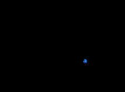 | 202 | EF_LEVEL99_3 | Lv 99 Aura Bubble |
| 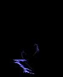 | 203 | EF_GUMGANG | Fury (Visual Effect) |
| 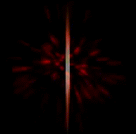 | 204 | EF_POTION1 | Red Herb/Potion |
| 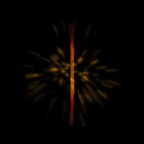 | 205 | EF_POTION2 | Orange Potion |
| 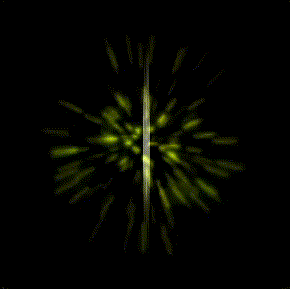 | 206 | EF_POTION3 | Yellow Herb/Potion |
| 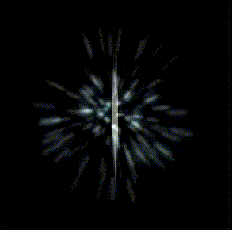 | 207 | EF_POTION4 | White Herb/Potion |
| 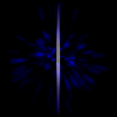 | 208 | EF_POTION5 | Blue Herb/Potion |
| 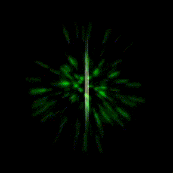 | 209 | EF_POTION6 | Green Herb/Potion |
| 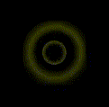 | 210 | EF_POTION7 | Yellow Circle Healing Effect |
| 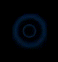 | 211 | EF_POTION8 | Blue Circle Healing Effect |
| 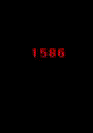 | 212 | EF_DARKBREATH | Dark Breath |
| 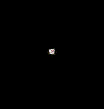 | 213 | EF_DEFFENDER | Defender |
|  | 214 | EF_KEEPING | Keeping |
|  | 215 | EF_SUMMONSLAVE | Summon Slave |
|  | 216 | EF_BLOODDRAIN | Blood Drain |
|  | 217 | EF_ENERGYDRAIN | Energy Drain |
| 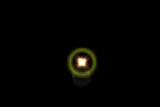 | 218 | EF_POTION_CON | Concentration Potion |
|  | 219 | EF_POTION_ | Awakening Potion |
| 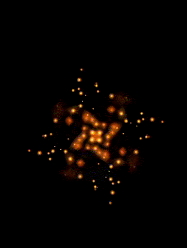 | 220 | EF_POTION_BERSERK | Berserk Potion |
| 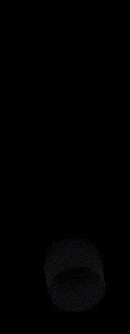 | 221 | EF_POTIONPILLAR | Intense light beam |
|  | 222 | EF_DEFENDER | Defender (Crusader) |
| 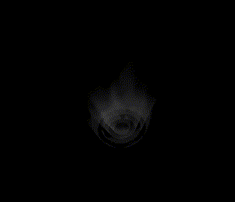 | 223 | EF_GANBANTEIN | Holy Cast Aura |
| 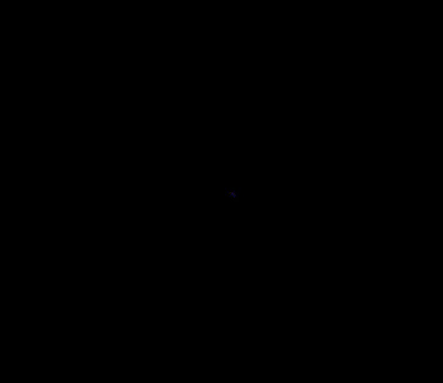 | 224 | EF_WIND | Wind (Map effect) |
|  | 225 | EF_VOLCANO | Volcano casting effect |
|  | 226 | EF_GRANDCROSS | Grand Cross Effect |
|  | 227 | EF_INTIMIDATE | Snatch |
|  | 228 | EF_CHOOKGI | (Nothing) |
|  | 229 | EF_CLOUD | (Nothing) |
|  | 230 | EF_CLOUD2 | (Nothing) |
|  | 231 | EF_MAPPILLAR | Map Light Pillar Animation 1 |
|  | 232 | EF_LINELINK | Sacrifice (Visual Effect) |
|  | 233 | EF_CLOUD3 | Fog |
|  | 234 | EF_SPELLBREAKER | Spell Breaker |
| 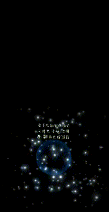 | 235 | EF_DISPELL | Dispell |
|  | 236 | EF_DELUGE | Deluge Cast Aura |
|  | 237 | EF_VIOLENTGALE | Violent Gale Cast Aura |
|  | 238 | EF_LANDPROTECTOR | Magnetic Earth Cast Aura |
|  | 239 | EF_BOTTOM_VO | Volcano (Visual Effect) |
|  | 240 | EF_BOTTOM_DE | Deluge (Visual Effect) |
|  | 241 | EF_BOTTOM_VI | Violent Gale (Visual Effect) |
|  | 242 | EF_BOTTOM_LA | Magnetic Earth (Visual Effect) |
|  | 243 | EF_FASTMOVE | (Invalid) |
|  | 244 | EF_MAGICROD | Magic Rod |
| 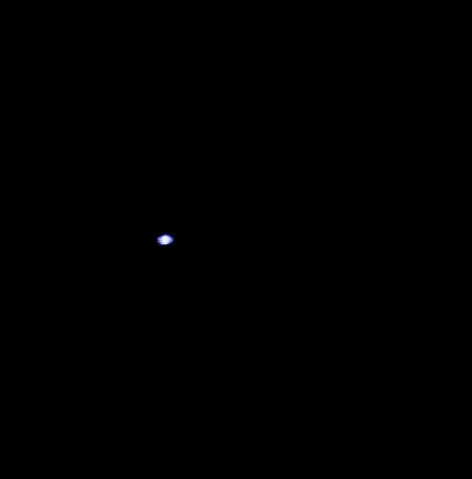 | 245 | EF_HOLYCROSS | Holy Cross |
|  | 246 | EF_SHIELDCHARGE | Shield Charge |
|  | 247 | EF_MAPPILLAR2 | Map Light Pillar Animation 2 |
|  | 248 | EF_PROVIDENCE | Resistant Souls |
|  | 249 | EF_SHIELDBOOMERANG | Shield Boomerang |
