# Effects 300 - 350

|    | ID | Name | Desc |
|----|----|------|------|
|  | 300 | EF_CHEMICALPROTECTION | Chemical Protection |
|  | 301 | EF_POKJUK_SOUND | Fire Works (Sound Effect) |
|  | 302 | EF_DEMONSTRATION | Bomb |
| 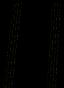 | 303 | EF_CHEMICAL2 | (Unused) |
|  | 304 | EF_TELEPORTATION2 | Teleportation Animation |
| 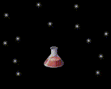 | 305 | EF_PHARMACY_OK | Pharmacy Success |
| 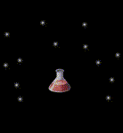 | 306 | EF_PHARMACY_FAIL | Pharmacy Failed |
|  | 307 | EF_FORESTLIGHT | Forest Light 1 |
|  | 308 | EF_THROWITEM3 | Throw Stone |
| 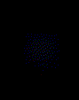 | 309 | EF_FIRSTAID | First Aid |
|  | 310 | EF_SPRINKLESAND | Sprinkle Sand |
| 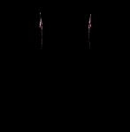 | 311 | EF_LOUD | Crazy Uproar |
|  | 312 | EF_HEAL | Heal Effect |
|  | 313 | EF_HEAL2 | Heal Effect 2 |
|  | 314 | EF_EXIT2 | Old Map Exit effect (Unused) |
|  | 315 | EF_GLASSWALL2 | Safety Wall |
|  | 316 | EF_READYPORTAL2 | Warp Portal Animation 1 |
|  | 317 | EF_PORTAL2 | Warp Portal Animation 2 |
|  | 318 | EF_BOTTOM_MAG | Magnus Exorcisimus Map Unit |
|  | 319 | EF_BOTTOM_SANC | Sanctuary Map Unit |
|  | 320 | EF_HEAL3 | Offensive Heal |
|  | 321 | EF_WARPZONE2 | Warp NPC |
| 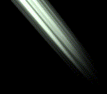 | 322 | EF_FORESTLIGHT2 | Forest Light 2 |
|  | 323 | EF_FORESTLIGHT3 | Forest Light 3 |
| 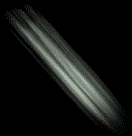 | 324 | EF_FORESTLIGHT4 | Forest Light 4 |
|  | 325 | EF_HEAL4 | Heal Effect 4 |
|  | 326 | EF_FOOT | Chase Walk Left Foot |
|  | 327 | EF_FOOT2 | Chse Walk Right Foot |
|  | 328 | EF_BEGINASURA | Monk Asura Strike |
|  | 329 | EF_TRIPLEATTACK | Triple Strike |
|  | 330 | EF_HITLINE | Combo Finish |
|  | 331 | EF_HPTIME | Natural HP Regeneration |
|  | 332 | EF_SPTIME | Natural SP Regeneration |
|  | 333 | EF_MAPLE | Autumn Leaves |
|  | 334 | EF_BLIND | Blind |
|  | 335 | EF_POISON | Poison |
|  | 336 | EF_GUARD | Kyrie Eleison/Parrying Shield |
|  | 337 | EF_JOBLVUP50 | Class Change |
|  | 338 | EF_ANGEL2 | Super Novice/Taekwon Level Up Angel |
| 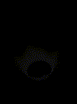 | 339 | EF_MAGNUM2 | Spiral Pierce |
|  | 340 | EF_CALLZONE | (Nothing) |
|  | 341 | EF_PORTAL3 | Wedding Warp Portal |
| 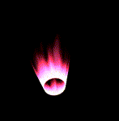 | 342 | EF_COUPLECASTING | Wedding Skill |
| 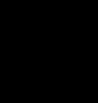 | 343 | EF_HEARTCASTING | Another Merry Skill |
|  | 344 | EF_ENTRY2 | Character map entry effect |
|  | 345 | EF_SAINTWING | Wings (Animated) |
| 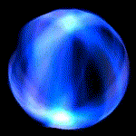 | 346 | EF_SPHEREWIND | Like Moonlight But Blue |
|  | 347 | EF_COLORPAPER | Wedding Ceremony |
|  | 348 | EF_LIGHTSPHERE | Like 1000 Blade trepassing |
|  | 349 | EF_WATERFALL | Waterfall (Horizonatal) |
