# Effects 350 - 400

|    | ID | Name | Desc |
|----|----|------|------|
|  | 350 | EF_WATERFALL_90 | Waterfall (Vertical) |
| 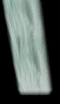 | 351 | EF_WATERFALL_SMALL | Small Waterfall (Horizonatal) |
| 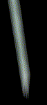 | 352 | EF_WATERFALL_SMALL_90 | Small Waterfall (Vertical) |
| 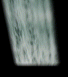 | 353 | EF_WATERFALL_T2 | Dark Waterfall (Horizonatal) |
| 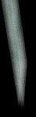 | 354 | EF_WATERFALL_T2_90 | Dark Waterfall (Vertical) |
| 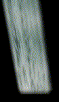 | 355 | EF_WATERFALL_SMALL_T2 | Dark Small Waterfall (Horizonatal) |
| 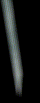 | 356 | EF_WATERFALL_SMALL_T2_90 | Dark Small Waterfall (Vertical) |
|  | 357 | EF_MINI_TETRIS | (Nothing) |
|  | 358 | EF_GHOST | Niflheim Ghost |
|  | 359 | EF_BAT | Niflheim Bat Slow |
|  | 360 | EF_BAT2 | Niflheim Bat Fast |
| 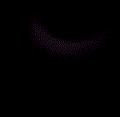 | 361 | EF_SOULBREAKER | Soul Destroyer |
| 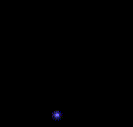 | 362 | EF_LEVEL99_4 | Trancendant Level 99 Aura 1 |
|  | 363 | EF_VALLENTINE | Valentine Day Heart With Wings |
| 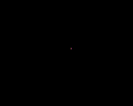 | 364 | EF_VALLENTINE2 | Valentine Day Heart |
|  | 365 | EF_PRESSURE | Gloria Domini |
|  | 366 | EF_BASH3D | Martyr's Reckoning |
|  | 367 | EF_AURABLADE | Aura Blade |
|  | 368 | EF_REDBODY | Berserk |
| 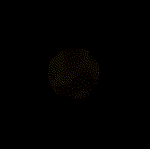 | 369 | EF_LKCONCENTRATION | Concentration |
|  | 370 | EF_BOTTOM_GOSPEL | Gospel Map Unit |
|  | 371 | EF_ANGEL | Level Up |
| 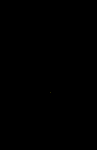 | 372 | EF_DEVIL | Death |
|  | 373 | EF_DRAGONSMOKE | House Smoke |
| 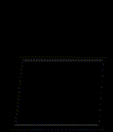 | 374 | EF_BOTTOM_BASILICA | Basilica |
|  | 375 | EF_ASSUMPTIO | Assumptio (Visual Effect) |
|  | 376 | EF_HITLINE2 | Palm Strike |
|  | 377 | EF_BASH3D2 | Matyr's Reckoning 2 |
| 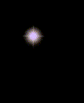 | 378 | EF_ENERGYDRAIN2 | Soul Drain (1st Part) |
|  | 379 | EF_TRANSBLUEBODY | Soul Drain (2nd Part) |
|  | 380 | EF_MAGICCRASHER | Magic Crasher |
| 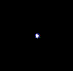 | 381 | EF_LIGHTSPHERE2 | Blue Starburst (Unknown use) |
|  | 382 | EF_LIGHTBLADE | (Nothing) |
| 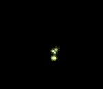 | 383 | EF_ENERGYDRAIN3 | Health Conversion |
|  | 384 | EF_LINELINK2 | Soul Change (Sound Effect) |
|  | 385 | EF_LINKLIGHT | Soul Change (Visual Effect) |
|  | 386 | EF_TRUESIGHT | True Sight |
|  | 387 | EF_FALCONASSAULT | Falcon Assault |
|  | 388 | EF_TRIPLEATTACK2 | Focused Arrow Strike (Sound Effect) |
|  | 389 | EF_PORTAL4 | Wind Walk |
| 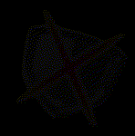 | 390 | EF_MELTDOWN | Shattering Strike |
| 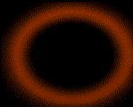 | 391 | EF_CARTBOOST | Cart Boost |
| 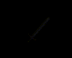 | 392 | EF_REJECTSWORD | Reject Sword |
|  | 393 | EF_TRIPLEATTACK3 | Arrow Vulcan |
| 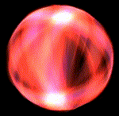 | 394 | EF_SPHEREWIND2 | Sheltering Bliss |
|  | 395 | EF_LINELINK3 | Marionette Control (Sound Effect) |
|  | 396 | EF_PINKBODY | Marionette Control (Visual Effect) |
|  | 397 | EF_LEVEL99_5 | Trancended 99 Aura (Middle) |
|  | 398 | EF_LEVEL99_6 | Trancended 99 Aura (Bottom) |
| 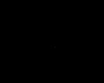 | 399 | EF_BASH3D3 | Head Crush |
