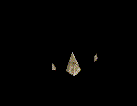
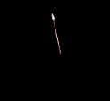
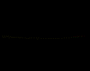
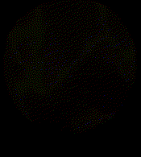

# Effects 50 - 100

|    | ID | Name | Desc |
|----|----|------|------|
|  | 50 | EF_FIRESPLASHHIT | Spinning Fire Thing |
|  | 51 | EF_COLDHIT | Ice Elemental Hit |
|  | 52 | EF_WINDHIT | Wind Elemental Hit |
|  | 53 | EF_POISONHIT | Puff of Purpulish Smoke? |
|  | 54 | EF_BEGINSPELL2 | Cast Initiation Aura (Water Element) |
|  | 55 | EF_BEGINSPELL3 | Cast Initiation Aura (Fire Element) |
|  | 56 | EF_BEGINSPELL4 | Cast Initiation Aura (Wind Element) |
|  | 57 | EF_BEGINSPELL5 | Cast Initiation Aura (Earth Element) |
|  | 58 | EF_BEGINSPELL6 | Cast Initiation Aura (Holy Element) |
|  | 59 | EF_BEGINSPELL7 | Cast Initiation Aura (Poison Element) |
|  | 60 | EF_LOCKON | Cast target circle |
|  | 61 | EF_WARPZONE | Old Warp Portal (NPC Warp, unused) |
|  | 62 | EF_SIGHTRASHER | Sight Trasher |
|  | 63 | EF_BARRIER | Moonlight Sphere |
|  | 64 | EF_ARROWSHOT | Something Like Puruple/Yellow Light Bullet |
|  | 65 | EF_INVENOM | Something Like Absorb of Power |
|  | 66 | EF_CURE | Cure |
|  | 67 | EF_PROVOKE | Provoke |
|  | 68 | EF_MVP | MVP Banner |
|  | 69 | EF_SKIDTRAP | Skid Trap |
|  | 70 | EF_BRANDISHSPEAR | Brandish Spear |
|  | 71 | EF_CONE | Spiral White balls |
|  | 72 | EF_SPHERE | Bigger Spiral White balls |
|  | 73 | EF_BOWLINGBASH | Blue/White Small Aura |
|  | 74 | EF_ICEWALL | Ice Wall |
|  | 75 | EF_GLORIA | Gloria |
|  | 76 | EF_MAGNIFICAT | Magnificat |
|  | 77 | EF_RESURRECTION | Resurrection |
|  | 78 | EF_RECOVERY | Status Recovery |
|  | 79 | EF_EARTHSPIKE | Earth Spike |
|  | 80 | EF_SPEARBMR | Spear Boomerang |
|  | 81 | EF_PIERCE | Skill hit |
|  | 82 | EF_TURNUNDEAD | Turn Undead |
|  | 83 | EF_SANCTUARY | Sanctuary |
|  | 84 | EF_IMPOSITIO | Impositio Manus |
|  | 85 | EF_LEXAETERNA | Lex Aeterna |
|  | 86 | EF_ASPERSIO | Aspersio |
|  | 87 | EF_LEXDIVINA | Lex Divina |
|  | 88 | EF_SUFFRAGIUM | Suffragium |
|  | 89 | EF_STORMGUST | Storm Gust |
|  | 90 | EF_LORD | Lord of Vermilion |
|  | 91 | EF_BENEDICTIO | B. S. Sacramenti |
|  | 92 | EF_METEORSTORM | Meteor Storm |
|  | 93 | EF_YUFITEL | Jupitel Thunder (Ball) |
|  | 94 | EF_YUFITELHIT | Jupitel Thunder (Hit) |
|  | 95 | EF_QUAGMIRE | Quagmire |
|  | 96 | EF_FIREPILLAR | Fire Pillar |
|  | 97 | EF_FIREPILLARBOMB | Fire Pillar/Land Mine hit |
|  | 98 | EF_HASTEUP | Adrenaline Rush |
|  | 99 | EF_FLASHER | Flasher Trap |
