# Effects 750 - 800

|    | ID | Name | Desc |
|----|----|------|------|
|  | 750 | EF_CONCENTRATION2 | Detonator (blue sparkles) |
| 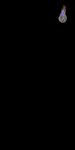 | 751 | EF_FIREBALL2 | Releasing summoned warlock spheres |
|  | 752 | EF_BUNSINJYUTSU2 | Like Energy Coat, but not as dark |
|  | 753 | EF_CLEARTIME | Clearance |
| 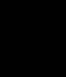 | 754 | EF_GLASSWALL3 | Green warp portal (root of Epiclesis) |
|  | 755 | EF_ORATIO | Oratio (spinning blue symbol) |
| 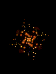 | 756 | EF_POTION_BERSERK2 | Enchant Blade (like Berserk Potion) |
| 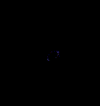 | 757 | EF_CIRCLEPOWER | Third Class Aura (Middle) |
|  | 758 | EF_ROLLING1 | Rolling Cutter - Spin Count 1 |
|  | 759 | EF_ROLLING2 | Rolling Cutter - Spin Count 2 |
| 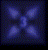 | 760 | EF_ROLLING3 | Rolling Cutter - Spin Count 3 |
| 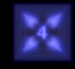 | 761 | EF_ROLLING4 | Rolling Cutter - Spin Count 4 |
| 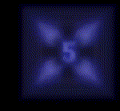 | 762 | EF_ROLLING5 | Rolling Cutter - Spin Count 5 |
| 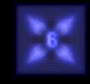 | 763 | EF_ROLLING6 | Rolling Cutter - Spin Count 6 |
|  | 764 | EF_ROLLING7 | Rolling Cutter - Spin Count 7 |
|  | 765 | EF_ROLLING8 | Rolling Cutter - Spin Count 8 |
|  | 766 | EF_ROLLING9 | Rolling Cutter - Spin Count 9 |
| 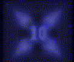 | 767 | EF_ROLLING10 | Rolling Cutter - Spin Count 10 |
|  | 768 | EF_PURPLEBODY | Blinking |
|  | 769 | EF_STIN6 | Cross Ripper Slasher (flying knives) |
|  | 770 | EF_RG_COIN4 | Strip sound |
|  | 771 | EF_POISONWAV | Poison sound |
|  | 772 | EF_POISONSMOKE | Poison particles |
| 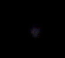 | 773 | EF_GUMGANG4 | Expanding purple aura (part of Phantom Menace) |
|  | 774 | EF_SHIELDBOOMERANG4 | Axe Boomerang |
|  | 775 | EF_CASTSPIN2 | Spinning character sprite |
|  | 776 | EF_VULCANWAV | Like Desperado sound effect |
|  | 777 | EF_AGIUP2 | Faded light from the ground [S] |
| 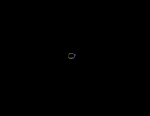 | 778 | EF_DETECT3 | Expanding white aura (like Clearance) |
|  | 779 | EF_AGIUP3 | Faded light from the ground [S] |
| 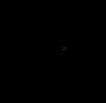 | 780 | EF_DETECT4 | Expanding red aura (from Infrared Scan) |
|  | 781 | EF_ELECTRIC3 | Magnetic Field (purple chains) |
|  | 782 | EF_GUARD4 | All-around shield [S] |
| 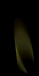 | 783 | EF_BOTTOM_BARRIER | Yellow shaft of light |
|  | 784 | EF_BOTTOM_STEALTH | White shaft of light |
|  | 785 | EF_REPAIRTIME | Upward flying wrenches |
| 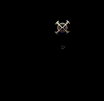 | 786 | EF_NC_ANAL | Symbol with bleeping sound [S] |
|  | 787 | EF_FIRETHROW | Flare Launcher (line of fire) |
|  | 788 | EF_VENOMIMPRESS | Venom Impress (green skull) |
|  | 789 | EF_FROSTMISTY | Freezing Status Effect (two ancillas) |
|  | 790 | EF_BURNING | Burning Status Effect (flame symbol) |
|  | 791 | EF_COLDTHROW | Two ice shots |
| 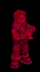 | 792 | EF_MAKEHALLU | Upward streaming white particles |
| 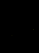 | 793 | EF_HALLUTIME | Same, but more brief |
| 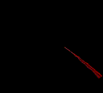 | 794 | EF_INFRAREDSCAN | Infrared Scan (red lasers) |
| 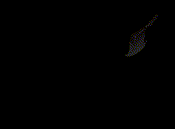 | 795 | EF_CRASHAXE | Power Swing (axe crash) |
| 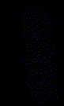 | 796 | EF_GTHUNDER | Spinning blue triangles |
|  | 797 | EF_STONERING | Stapo |
|  | 798 | EF_INTIMIDATE2 | Red triangles (like Intimidate) |
| 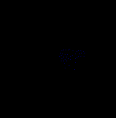 | 799 | EF_STASIS | Stasis (expanding blue mist) [S] |
