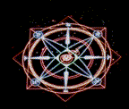
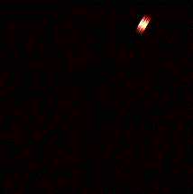
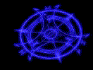
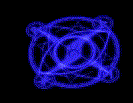

# Effects 650 - 700

|    | ID | Name | Desc |
|----|----|------|------|
|  | 650 | EF_MAP_MAGICZONE | Ice Cave Level 4 Circle |
|  | 651 | EF_MAP_MAGICZONE2 | Ice Cave Level 4 Big Circle |
|  | 652 | EF_DAMAGE1 | Like Regeneration Number but Red with a Sound |
|  | 653 | EF_DAMAGE1_2 | Like Regeneration Number but Red |
|  | 654 | EF_DAMAGE1_3 | Like Regeneration Number but Purple |
|  | 655 | EF_UNDEADBODY | Mobs Skill (Change Undead Element) |
|  | 656 | EF_UNDEADBODY_DEL | Last animation before Change Undead Element finish |
|  | 657 | EF_GREEN_NUMBER | (Nothing) |
|  | 658 | EF_BLUE_NUMBER | (Nothing) |
|  | 659 | EF_RED_NUMBER | (Nothing) |
|  | 660 | EF_PURPLE_NUMBER | (Nothing) |
|  | 661 | EF_BLACK_NUMBER | (Nothing) |
|  | 662 | EF_WHITE_NUMBER | (Nothing) |
|  | 663 | EF_YELLOW_NUMBER | (Nothing) |
|  | 664 | EF_PINK_NUMBER | (Nothing) |
|  | 665 | EF_BUBBLE_DROP | Little Blue Ball Falling From the Sky |
|  | 666 | EF_NPC_EARTHQUAKE | Earthquake |
|  | 667 | EF_DA_SPACE | (Nothing) |
|  | 668 | EF_DRAGONFEAR | Dragonfear |
|  | 669 | EF_BLEEDING | Wide Bleeding |
|  | 670 | EF_WIDECONFUSE | Dragon fear (Visual Effect) |
|  | 671 | EF_BOTTOM_RUNNER | The Japan Earth Symbol (like 'Seven Wind Lv1', but on the ground) |
|  | 672 | EF_BOTTOM_TRANSFER | The Japan Wind Symbol (like 'Seven Wind Lv2', but on the ground) |
|  | 673 | EF_CRYSTAL_BLUE | Map turns Blue (like Soul Link) |
|  | 674 | EF_BOTTOM_EVILLAND | Evil Land Cell |
|  | 675 | EF_GUARD3 | Like Parrying/Kyrie Eleison barrier but Yellow with small Cross in every barrier piece |
|  | 676 | EF_NPC_SLOWCAST | Slow Casting |
|  | 677 | EF_CRITICALWOUND | Critical Wounds/Bleeding Attack |
|  | 678 | EF_GREEN99_3 | White 99 Aura Bubbles |
|  | 679 | EF_GREEN99_5 | Green Aura (Middle) |
|  | 680 | EF_GREEN99_6 | Green Aura (Bottom) |
|  | 681 | EF_MAPSPHERE | Dimensional Gorge Map Effect |
|  | 682 | EF_POK_LOVE | I Love You Banner |
|  | 683 | EF_POK_WHITE | Happy White Day Banner |
|  | 684 | EF_POK_VALEN | Happy Valentine Day Banner |
|  | 685 | EF_POK_BIRTH | Happy Birthday Banner |
|  | 686 | EF_POK_CHRISTMAS | Merry Christmas Banner |
|  | 687 | EF_MAP_MAGICZONE3 | Cast Circle-Like effect 1 |
|  | 688 | EF_MAP_MAGICZONE4 | Cast Circle-Like effect 2 |
|  | 689 | EF_DUST | Endless Tower Map Effect |
|  | 690 | EF_TORCH_RED | Burning Flame (Red) |
|  | 691 | EF_TORCH_GREEN | Burning Flame (Green) |
|  | 692 | EF_MAP_GHOST | Unknown Aura Bubbles (Small ghosts) |
|  | 693 | EF_GLOW1 | Translucent yellow circle |
|  | 694 | EF_GLOW2 | Translucent green circle |
|  | 695 | EF_GLOW4 | Rotating green light |
|  | 696 | EF_TORCH_PURPLE | The same of 690 and 691 but Blue/Purple |
|  | 697 | EF_CLOUD7 | (Nothing) |
|  | 698 | EF_CLOUD8 | (Nothing) |
|  | 699 | EF_FLOWERLEAF | Fall of powder from the sky and raise of some leaf |
